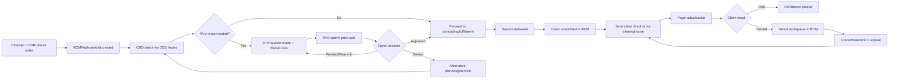
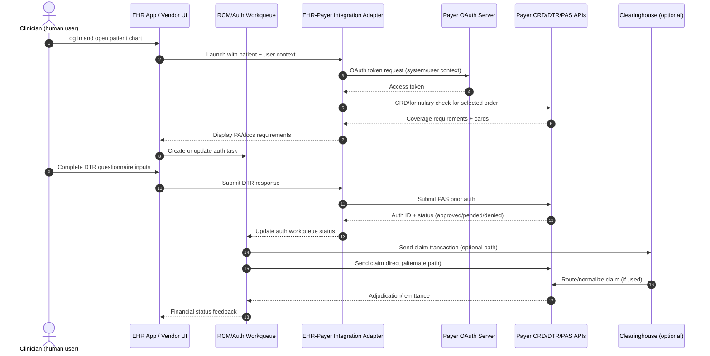
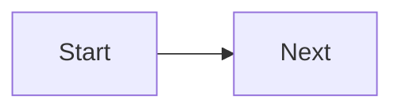

# EHR ↔ Payer Integration Blueprint (Formulary + CRD + DTR + PAS)

## Why this document
This is a practical, developer-focused map for joining:
- **EHR patient/order data** (Epic/Cerner side)
- **Payer coverage logic** (formulary + prior auth services)

No payer portal UI login is required for the runtime workflow; integration happens through APIs.

---

## Systems and roles
- **EHR / Vendor portal (Epic/Cerner app)**
  - Holds patient chart, medications, diagnoses, orders
  - Knows active coverage/member context
- **RCM (Revenue Cycle Management) app/module**
  - Builds auth worklists, tracks pending/approved auths, and prepares claim-ready billing context
  - May be bundled with EHR vendor tooling or run as a separate platform
- **Clearinghouse (optional but common)**
  - Validates/translates/routes transactions between provider systems and payer endpoints
  - Usually a transport/normalization entity, not final medical necessity decision-maker
- **Payer APIs**
  - Formulary API (Phase 4, port `5240`)
  - CRD CDS Hooks API (Phase 5, port `5250`)
  - DTR + PAS API (Phase 6, port `5260`)

---

## Quick glossary (plain English)
- **CRD**: Coverage Requirements Discovery. Real-time check during ordering: "Does this need PA/docs?"
- **DTR**: Documentation Templates and Rules. Structured questions/doc checklist to justify medical necessity.
- **PAS**: Prior Authorization Support. Submit PA, retrieve status updates, handle approval/denial/pended.
- **RCM**: Revenue Cycle Management. Operational workflow for auth tracking, claim prep, denial follow-up.
- **Clearinghouse**: Real intermediary platform that validates/translates/routes transactions.

---

## End-to-end workflow diagram (start to finish)


Tip: In this project, Phases 4-6 focus mostly on the pre-service section (C through H), which is where most avoidable denials begin.

---

## Who logs in where (sequence diagram)


Interpretation:
- Human login is typically the clinician in EHR.
- Most payer calls are system-to-system with OAuth trust.
- RCM tracks operational state even when clinical UI is in EHR.

---

## Mermaid quick start (copy/paste guide)

### 0) Preview shortcut in VS Code
- Open Markdown preview to the side: `Ctrl+K V`
- Alternate preview shortcut: `Ctrl+Shift+V`

### 1) Basic rule
Wrap Mermaid text inside a fenced block with `mermaid`:

~~~markdown

~~~

### 2) Common diagram types
- `flowchart LR` or `flowchart TD`: process flows
- `sequenceDiagram`: actor/system message exchanges
- `classDiagram`: object/class relationships
- `stateDiagram-v2`: lifecycle states

### 3) Small syntax cheats
- Node: `A[Box]`, `B(Rounded)`, `C{Decision}`
- Arrow: `A --> B` (solid), `A -.-> B` (dotted)
- Labeled arrow: `A -->|Yes| B`
- Sequence participants:
  - `actor Clinician`
  - `participant API`
  - `Clinician->>API: Request`

### 4) Frequent mistakes
- Missing `mermaid` in code fence info string
- Unbalanced brackets in node labels
- Using special characters heavily in IDs (keep IDs simple: `A1`, `Step2`)
- Mixing tabs/spaces inconsistently in long diagrams

### 5) Fast edit strategy
1. Start with 3-4 nodes only.
2. Confirm it renders.
3. Add branches/messages incrementally.
4. If it breaks, remove last edit block and re-add line by line.

---

## 7-step runtime workflow (what your app does)

### 1) Get patient prescriptions in EHR context
```http
GET http://localhost:5240/api/fhir/MedicationRequest?patient=51707&_count=10
```
Use this to identify the medication being prescribed/renewed.

### 2) Identify member plan (coverage context)
From EHR `Coverage` / insurance card mapping, determine plan ID (example: `PLAN-PPO-2026`).

### 3) Formulary coverage check (payer rules)
```http
GET http://localhost:5240/api/formulary/CoverageCheck?drugName=Ozempic&planId=PLAN-PPO-2026
```
If response includes `requiresPriorAuth=true` or `stepTherapy=true`, continue.

### 4) Optional CRD pre-check during ordering (CDS Hooks)
```http
POST http://localhost:5250/cds-services/crd-order-select
Content-Type: application/json

{
  "hook": "order-select",
  "hookInstance": "abc-123",
  "fhirServer": "http://localhost:8082/fhir",
  "context": {
    "patientId": "51707",
    "orderItems": [
      {
        "code": "1991302",
        "display": "Ozempic"
      }
    ]
  }
}
```
CRD returns cards indicating prior auth and documentation requirements.

### 5) Fetch DTR questionnaire for required service
```http
GET http://localhost:5260/api/dtr/Questionnaire/by-service/1991302
```
Render questions in your app and collect provider answers.

### 6) Submit completed documentation (DTR response)
```http
POST http://localhost:5260/api/dtr/Questionnaire/response
Content-Type: application/json

{
  "questionnaireId": "DTR-Q-1991302",
  "patientId": "51707",
  "answers": {
    "diabetes-diagnosis": "Type 2 Diabetes Mellitus",
    "current-hba1c": "8.5",
    "metformin-trial": "Yes"
  }
}
```
Save returned `responseId`.

### 7) Submit PAS prior auth and poll status
```http
POST http://localhost:5260/api/pas/PriorAuth/submit
Content-Type: application/json

{
  "patientId": "51707",
  "serviceCode": "1991302",
  "serviceDescription": "Ozempic (semaglutide)",
  "providerId": "PRACT-010",
  "providerName": "Dr. Endocrinologist",
  "diagnosis": "Type 2 Diabetes",
  "urgency": "routine",
  "questionnaireResponseId": "<responseId-from-step-6>",
  "supportingDocuments": ["HbA1c lab", "Medication history"]
}
```
Then check status:
```http
GET http://localhost:5260/api/pas/PriorAuth/status/{authorizationId}
```

---

## Decision logic in UI (recommended)
- If `isCovered=false`: show non-formulary message + alternatives
- If `requiresPriorAuth=true`: open DTR + PAS flow
- If `stepTherapy=true`: show first-line alternatives and guidance
- If covered with high cost: show lower-tier alternatives

---

## Minimal integration contract your EHR adapter needs
- `patientId`
- `planId` (payer plan/product identifier)
- drug identifier (`drugName` and/or RxNorm)
- ordering provider context
- diagnosis/problem list context (for PA justification)

---

## Authentication in real environments
For production, replace open localhost assumptions with payer onboarding:


## IG conformance checklist (beginner-friendly)
Use this before connecting to a real payer/EHR partner.

### Stage 1: Local functional checks (your environment)
- Confirm Formulary endpoints respond correctly (`/api/formulary/Plan`, `/Drug`, `/CoverageCheck`)
- Confirm CRD discovery endpoint works: `GET http://localhost:5250/cds-services`
- Confirm CRD hook handling returns valid cards for sample order items
- Confirm DTR questionnaire lookup + response submission works end-to-end
- Confirm PAS submit + status inquiry lifecycle works

### Stage 2: FHIR shape and semantics checks
- Ensure request/response payloads follow expected FHIR patterns used by the IG
- Verify required fields are present (patient context, codes, status, identifiers)
- Verify code systems are consistent (e.g., RxNorm/NUCC/CPT where applicable)
- Verify HTTP behavior is consistent (status codes, error payload shape)

### Stage 3: HL7 test tooling conformance
- Run test scripts in HL7 tooling (e.g., Touchstone scenarios for target IG workflows)
- Validate pass/fail against profile and interaction expectations
- Fix failures iteratively (missing elements, incorrect bindings, operation behavior)

### Stage 4: Partner sandbox readiness
- Publish capability/conformance docs for your API behavior
- Validate OAuth scopes and token handling against partner requirements
- Re-run key conformance scenarios in partner sandbox
- Capture evidence: test reports + sample payloads + known limitations

### Exit criteria (ready for onboarding)
- Core workflows pass locally and in test tooling
- Critical IG scenarios pass in partner sandbox
- Auth/security controls validated
- Error handling and audit logging verified

You can replicate payer-EHR interoperability without payer portal UI access by implementing API orchestration:
1. Read EHR medication/order data
2. Call payer formulary/CRD APIs
3. Collect documentation (DTR)
4. Submit and track authorization (PAS)

This is the same integration pattern used in real payer-provider workflows.
